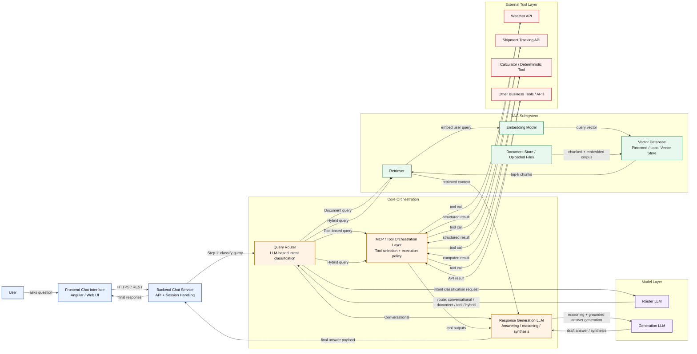
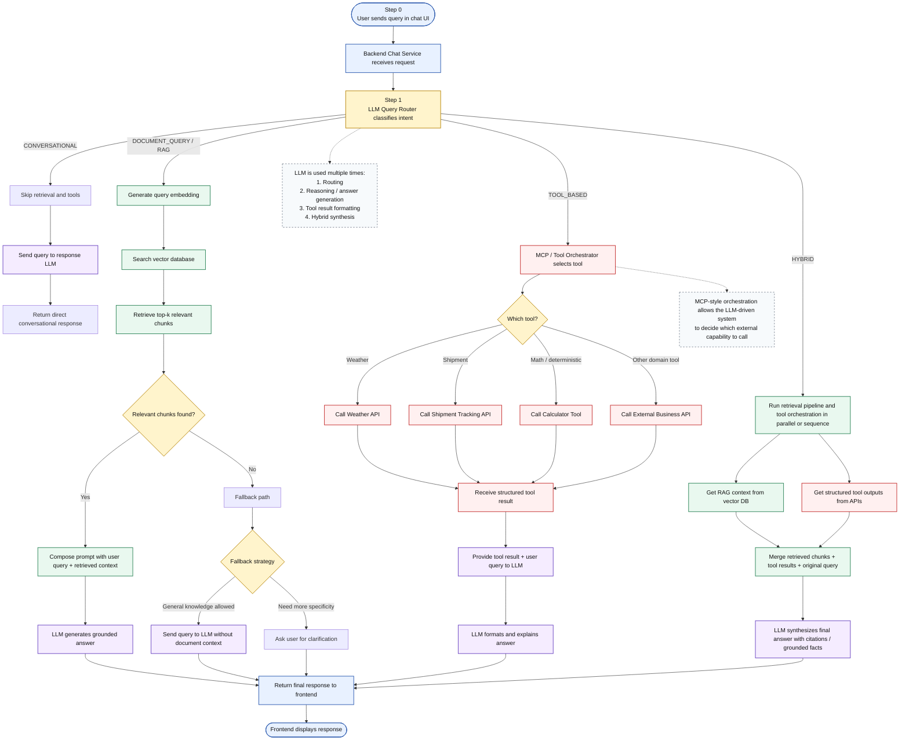

# Architecture Diagrams

This document contains two Mermaid diagrams for the AI-powered chatbot architecture:

1. High-level architecture view
2. Low-level query routing and response flow

These diagrams are intended for developer handoff, architecture review, and stakeholder presentations.

## High-Level Architecture Diagram

Key points:
- The frontend sends user queries to the backend chat service.
- The backend uses an LLM-based query router as the first step.
- Queries can go to conversational handling, RAG retrieval, tool orchestration, or a hybrid path.
- External APIs and tools are accessed through an orchestration layer.
- The LLM is used both for routing and for final response generation/synthesis.

## Low-Level Sequence / Flow Diagram

Key points:
- Every query first goes through the LLM query router.
- The router classifies the request into conversational, document query, tool-based, or hybrid.
- RAG flows include embeddings, retrieval, chunk selection, and grounded generation.
- Tool-based flows use external APIs or deterministic tools, then pass structured output to the LLM.
- Hybrid flows combine both RAG context and tool results before final synthesis.
- Fallback handling is included when document retrieval does not return relevant chunks.

